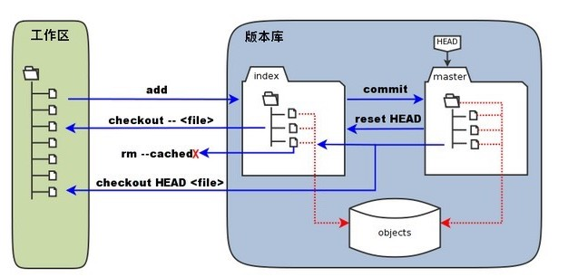
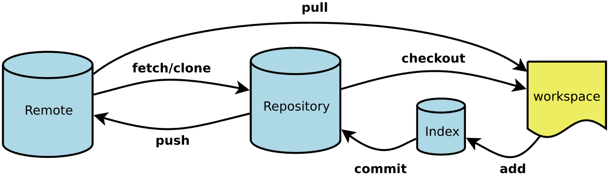

# Git   
## 开源的版本控制系统
* [准备工作](ready.md)
* [分支管理](branch.md)
* [回滚重置](reset.md)
* [冲突解决](conflict.md)
* [放入缓存](stash.md)
* [版本发布](released.md)

## Git 工作区、暂存区、版本库

## Tip

    工作区和暂存区是公共的，dev分支更改的切换到master还是可以看到。

## 日常工作中常用的命令

    git checkout   
    git stash  
    git reset   
    git add  
    git commit   
    git pull/push
