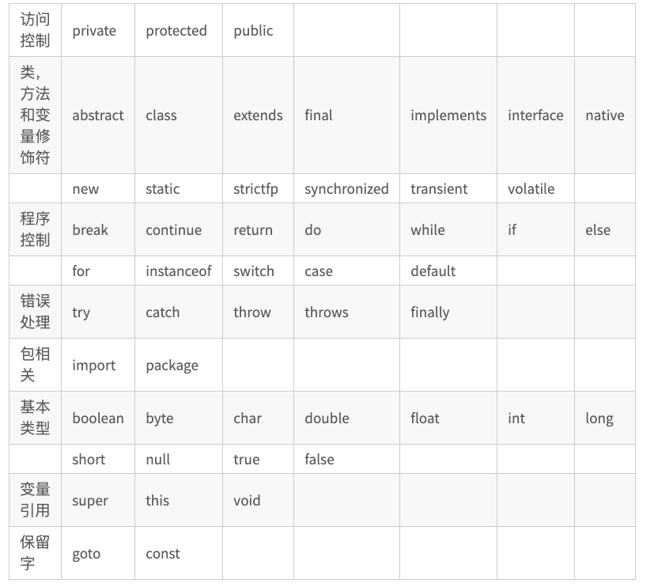

[首页](/README.md)

>## <div id="2">2 JAVA语言基础</div>

  >> ###  <div id="2.1" >2.1 基本数据类型</div>  
|  类型 | 名称  |大小  | 初始值|
| ---- | ---- | ---- | ---- |
| byte | 字节型|1 字节 |  0   |
|short|短整型|2字节|0|
|int|整型|4字节|0|
|long|长整型|8字节|0|
|float|浮点型|4字节|0.0|
|double|双精度浮点型|8字节|0.0|
|boolean|布尔型|1字节|false|
|char|字符型|2字节|\u0000|

>>   ###  2.2 关键字 & 变量
>>> ### 2.2.1关键字
        1. JAVA中一些赋予特定的含义的标识符，用做专门用途的字符串称为关键字
  
 >>> ### 2.2.2变量
    变量：变量是存储信息（数据）的容器。
    语法： [ 修饰符 ] 数据类型 变量名字 [赋值操作]
    int a；
    boolean flag = false；

>>   ###  2.3 引用数据类型
`栈内存 & 堆内存`  
>>> ### 2.2.1 String   
    String str = “abc”；
    char c = ‘A’；
    “” 和‘’注意区别；
>>> ### 2.2.2 Arrary
Java 语言中提供的数组是用来存储固定大小的同类型元素。
* 数据类型相同 
* 有序
* 固定大小

```
public static void main(String[] args) {  
    // 1.方式一  声明 分配空间并赋值  
    int[] arr1 = {1,2,3};  
    // 2.方式二 显示初始化  
    int[] arr2;  
    arr2 = new int[]{1,2,3};   
    // 3.方式三 显示初始化()  
    int[] arr3;  
    arr3 = new int[3];  
}  
```

