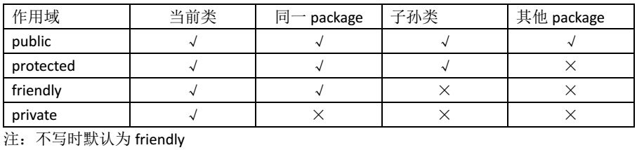

# java项目目录结构建议

    controller ： 主要是对外的接口
    service ： 核心业务逻辑
    dao/mapper ： 数据库访问层
    entity： 实体类，字段和数据库保持一致
    vo： 前端专用类型，避免暴露数据库结构
    common： 基础工具包和常量package
# 类
 
# 接口 
    多继承
# 继承 
    1.从父类那里继承所有非私有成员作为自己的成员。
    2.子类的每个对象也是其父类的对象，这是继承性的“即是”性质。
    也就是说，若SubClass继承SuperClass，则SubClass即是SuperClass，
    所以在任何可以使用SuperClass实例的地方，
    都允许使用SubClass实例，反之则不然，父类对象不一定是它的子类的对象。
## 为什么使用继承

1. 实现代码重用
2. 提高程序开发效率
3. 降低维护工作量

## 类     继承(单)
## 接口   继承（多继承）

# 重载 重写
## 重写的规则
    参数列表与被重写方法的参数列表必须完全相同。
    返回类型与被重写方法的返回类型可以不相同，但是必须是父类返回值的派生类（java5 及更早版本返回类型要一样，java7 及更高版本可以不同）。
    访问权限不能比父类中被重写的方法的访问权限更低。例如：如果父类的一个方法被声明为 public，那么在子类中重写该方法就不能声明为 protected。
    父类的成员方法只能被它的子类重写。
    声明为 final 的方法不能被重写。
    声明为 static 的方法不能被重写，但是能够被再次声明。
    子类和父类在同一个包中，那么子类可以重写父类所有方法，除了声明为 private 和 final 的方法。
    子类和父类不在同一个包中，那么子类只能够重写父类的声明为 public 和 protected 的非 final 方法。
    重写的方法能够抛出任何非强制异常，无论被重写的方法是否抛出异常。但是，重写的方法不能抛出新的强制性异常，或者比被重写方法声明的更广泛的强制性异常，反之则可以。
    构造方法不能被重写。
    如果不能继承一个类，则不能重写该类的方法
## 重载规则
    被重载的方法必须改变参数列表(参数个数或类型不一样)；
    被重载的方法可以改变返回类型；
    被重载的方法可以改变访问修饰符；
    被重载的方法可以声明新的或更广的检查异常；
    方法能够在同一个类中或者在一个子类中被重载。
    无法以返回值类型作为重载函数的区分标准。
##  两者区别
    区别点	重载方法	重写方法
    参数列表	必须修改	一定不能修改
    返回类型	可以修改	一定不能修改
    异常	可以修改	可以减少或删除，一定不能抛出新的或者更广的异常
    访问	可以修改	一定不能做更严格的限制（可以降低限制）
